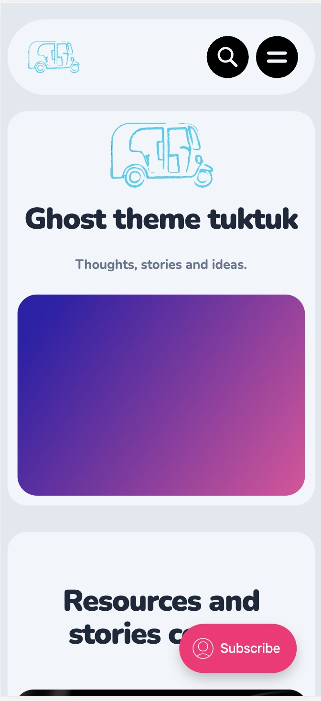

# Tuktuk

Tuktuk is a minimal theme for the Ghost blogging platform. It features a clean, elegant design that is perfect for blogging.
<!--


-->
Live demo available [here](https://demo-ghost.jean-nguyen.dev).

## Table of Contents
- [Features](#features)
- [Installation](#installation)
- [Building](#building)
- [Customization](#customization)
- [Reporting Bugs](#reporting-bugs)
- [Contributing](#contributing)
- [License](#license)

## Features
- Minimal, blogging-friendly design
- Responsive design for all devices
- Support for Ghost 5.0.0 and later
- Tailwind CSS for rapid development

## Installation
Clone the repository into your Ghost themes directory:

```
git clone https://github.com/jibenight/Ghost-theme-tuktuk.git
```

Then, restart your Ghost instance. You can select the Tuktuk theme in your Ghost admin panel.

## Building
The theme comes with a few NPM scripts for development and production builds.

### Development
```shell
npm run dev
```

### Production
```shell
npm run build
```

## Customization
The Tuktuk theme provides several custom settings to make it easy for you to personalize your blog. You can control things like the number of posts per page, the size of images, the layout of navigation, typography, header styles, color schemes, and much more.

All these settings can be found and modified within the `config` key in the `package.json`.

## Reporting Bugs
If you encounter any bugs or issues, please report them on the [issues page](https://github.com/jibenight/Ghost-theme-tuktuk/issues).

## Contributing
We welcome contributions from the community. Please refer to our [contributors guide](https://github.com) for more details.

## License
The Tuktuk theme is released under the MIT License. Check out the [LICENSE](./LICENSE) file for more details.

## Contact
For further inquiries, you can reach out to Jean at contact@jean-nguyen.dev or visit his personal [website](https://jean-nguyen.dev).
